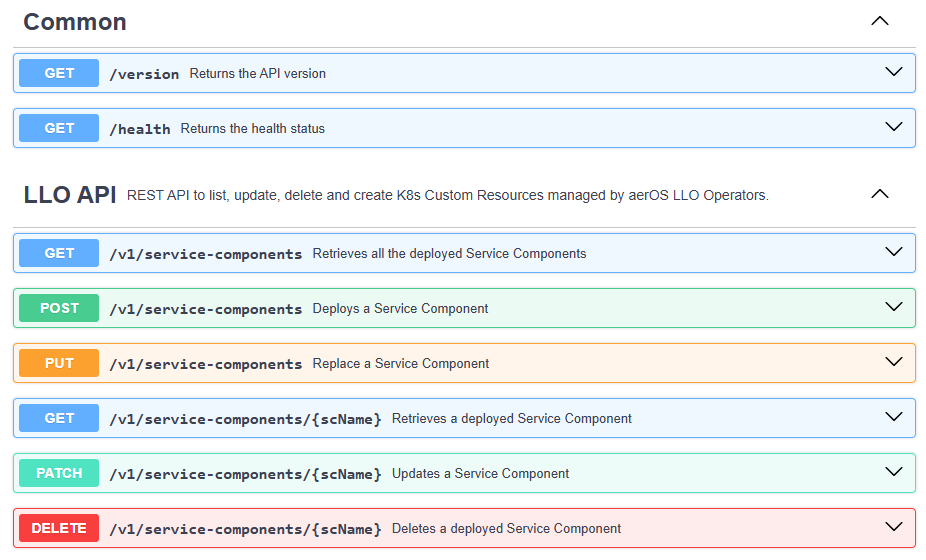

# aeriOS LLO Custom Resources API

REST API to list, delete and create K8s Custom Resources managed by aeriOS LLO Operators. This API uses the **default namespace**.

Developed using Go, Gin Web Framework and K8s Dynamic client.

## Endpoints

A [Postman collection](docs/LLO_CR_API.postman_collection.json) along with an [OpenAPI file](docs/openapi.yml) have been included.

- GET /version
- GET /health
- GET /v1/service-components
- GET /v1/service-components/:serviceComponentName
- POST /v1/service-components
- PUT /v1/service-components
- PATCH /v1/service-components/:serviceComponentName
- DELETE /v1/service-components/:serviceComponentName



### Valid query parameters

For *GET /v1/service-components/\** and *DELETE /v1/service-components/:serviceComponentName* endpoints:

- *type*: docker or k8s (default value).
- *onlyNames*: boolean (true or false).

### Response headers

For *GET /v1/service-components* endpoint:

- *Llo-Type*: K8s Custom Resource of the service components.
- *Results-Count*: number of service components in the cluster, which is the length of the returned array indeed.

## Docker image 
A Dockerfile is provided for Linux/AMD64, but in the future it is expected to create container images for ARM64.

```bash
docker build -t eclipseaerios/llo-api:1.2.0 --build-arg COMMIT_HASH=$(git rev-parse HEAD) .
```

### Multi-arch image

```bash
docker buildx build  --push --platform=linux/arm64,linux/amd64 -t <container-image-repository-url>/llo-api --build-arg COMMIT_HASH=$(git rev-parse HEAD) .
```

or

```bash
make docker-buildx-gitlab IMG=<container-image-repository-url>/llo-api:1.2.0
```

## Deployment in a K8s cluster

First, the needed CRDs (**servicecomponentk8s.llo.aeros-project.eu** or **servicecomponentk8s.llo.aeros-project.eu**) must be installed in the K8s cluster (they are included in the LLOs Helm charts).


### Helm chart

A Helm chart has been created and uploaded to the Common Deployments repository of Gitlab.

```bash
helm repo add eclipse-aerios https://eclipse-aerios.github.io/resources/charts
```

```bash
helm install aerios-llo-api eclipse-aerios/llo-api --debug
```

## Local Development

- Line 20 of *main.go*: change to "localhost:8090" to avoid problems with firewalls.
- Lines 23-26 of *config/k8sclient.go*: change the path to the preferred local default kubeconfig file, which is located by default in *$HOME/.kube/config*.